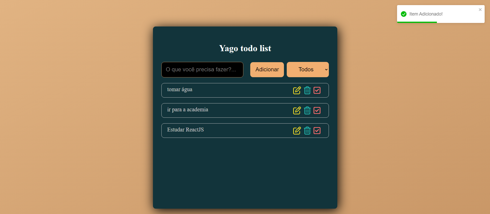

<h2 align="center">
  Todo List Project 
</h2>

## Projeto Final:

## Feito com

Esse projeto foi construido com essas tecnologias:

- React.js
- Node.js
- CSS3
- VsCode

## 🛠 Instrução para configuração e instalação

1. Instalação: `npm install`

2. Para visualizar o projeto: `npm start`

Abra [http://localhost:3000](http://localhost:3000) para ver pelo navegador
